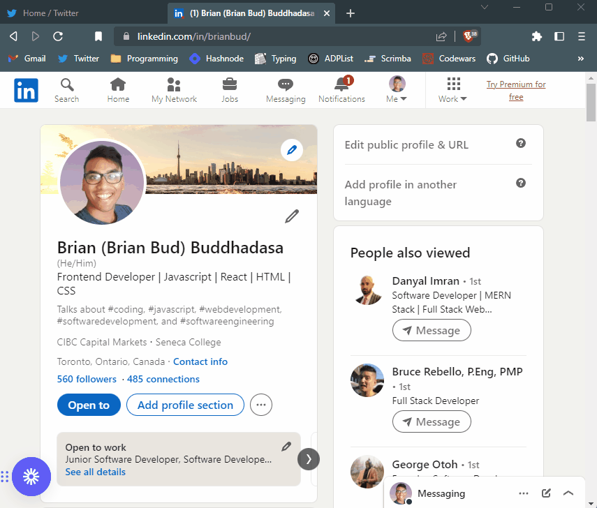

# Lead Tracker

A browser extension that manages a list of leads and saves them to local storage. It has buttons for adding the current tab's URL, deleting all leads, and adding a lead from an input field. The list is rendered in the DOM as an HTML list.



## How's it made

Main functions and event listeners defined in this code:

- Adding the current tab's URL to the list when a "tab" button is clicked.
- Clearing the local storage and resetting the list to an empty array when a "delete" button is double-clicked.
- Adding the value entered in an input field to the list when an "input" button is clicked.
- Generating an HTML list from the list of leads and inserting it into the DOM.

**Tech used:** HTML, CSS, JavaScript

## Lessons Learned:

- addEventListener
- input.value
- how to save things in localStorage
- how to deploy a chrome extension in chrome://extensions
- working with JSON object ( JSON.stringify and JSON.parse)
- when to use innerHTML vs textContent

## Quick start:

```
$ npm install
$ npm start
```

Loan unpacked folder in chrome://extensions

Thank you for checking out my project!
